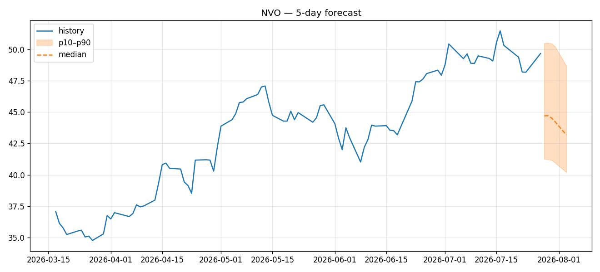

# PyQuant

Probabilistic equity forecasting with a [Temporal Fusion Transformer](https://arxiv.org/abs/1912.09363):
a leak-audited daily panel from four vendors, 5-day p10/p50/p90 forecasts, and the
feature attributions behind them, from a Rich terminal UI or an HTTP API.

[](https://github.com/AxelSuu/Pytorch-Quant-Model/actions/workflows/ci.yml)
[](https://github.com/AxelSuu/Pytorch-Quant-Model/actions/workflows/docs.yml)
[](https://github.com/AxelSuu/Pytorch-Quant-Model/actions/workflows/nightly.yml)

**Documentation: [axelsuu.github.io/Pytorch-Quant-Model](https://axelsuu.github.io/Pytorch-Quant-Model/)**:
architecture, leakage invariants, methodology, CLI and HTTP references, and the full API
reference. Rebuilt on every push to `main`, and nightly against live upstream inventories.



## Does it beat a benchmark?

This is the project's central open problem. The TFT is a multi-horizon time series forecasting model, but the data is a near-random-walk series, so the baseline is hard to beat.

## Install

PyQuant uses [uv](https://docs.astral.sh/uv/). All extras are optional.

```bash
uv sync                       # core install
uv sync --extra sentiment     # + FinBERT news sentiment (downloads the model on first use)
uv sync --extra api           # + the FastAPI service
uv sync --extra tuning        # + Optuna hyperparameter search
```

## Quickstart

Defaults: 5 years of daily bars, a 60-day lookback, a 5-day horizon, p10/p50/p90 quantiles,
up to 30 epochs with early stopping, and a 60-trading-day validation holdout.

```bash
uv run pyquant train AAPL       # train a TFT  ->  checkpoints/AAPL/
uv run pyquant forecast AAPL    # 5-day p10/p50/p90 forecast + fan chart
uv run pyquant explain AAPL     # which features and which days drove it
```

## Commands

| Command | What it does |
|---|---|
| `train SYMBOLS` | Train a TFT and save a bundle. Comma-separated symbols pool into one model. |
| `forecast SYMBOL` | Quantile forecast, fan chart, and live options context. |
| `explain SYMBOL` | Feature importances + temporal attention for the forecast. |
| `scan SYMBOLS` | Compare forecasts across several trained symbols. |
| `backtest SYMBOL` | Walk-forward evaluation across rolling origins; `--signals` scores BUY/SELL P&L. |
| `tune SYMBOL` | Optuna hyperparameter search; writes the winner to `configs/`, scored on a held-out period no trial saw. |
| `snapshot SYMBOL` | Record today's options snapshot into an accumulating per-symbol history. |
| `doctor` | Report configured keys/extras and whether every trained bundle is still usable. |
| `cache list\|prune\|rm-pin` | Inspect and prune the local data-panel cache. |

Common flags: `train --epochs 50 --period 10y`, `train --name my_bundle` to override the
bundle directory, `backtest --windows 10`, `explain --top 20`, `forecast --export aapl.png`
to also write a PNG, and `--no-macro / --no-sentiment / --no-sectors` on `train`/`backtest`
for a leaner feature set. `pyquant <command> --help` has the rest.

**Global flags go *before* the subcommand** — `pyquant --debug train AAPL`: `--format json`,
`--quiet/-q`, `--verbose/-v`, `--debug`.

Full reference, including exit codes:
[docs/cli](https://axelsuu.github.io/Pytorch-Quant-Model/cli.html).

## How it works

Every enrichment join degrades gracefully: a source that is missing a key, rate-limited, or
disabled is dropped with a logged notice rather than failing the run. At predict time a
missing trained feature is a hard error instead — a model cannot run without the columns it
was trained on.

```
yfinance ─┐
FRED ─────┤   pyquant/data/*  ─►  unified daily panel  ─►  TimeSeriesDataSet
Finnhub ──┤   (graceful joins)        (dataset.py)              │
sectors ──┘                                                     ▼
                                          TemporalFusionTransformer (models/tft.py)
                                                                │
                              ┌─────────────────────────────────┤
                              ▼                                 ▼
                    quantile forecast                  feature importance
                    (analysis/forecast.py)             + attention (analysis/interpret.py)
                              └────────────────┬────────────────┘
                                               ▼
                                    Rich CLI (cli/app.py)
                                    FastAPI  (api/app.py)
```

pytorch-forecasting and Lightning are confined to `models/tft.py` and `data/dataset.py`;
`analysis/` and `models/` never import Typer, Rich or FastAPI. That is what made the HTTP
service additive rather than a rewrite — both front-ends call the same functions and share
the same serializers, so their outputs cannot drift apart.

## Using it

### Pooling

`train AAPL,MSFT,NVDA` trains a single model across all three rather than one model per
ticker. It saves to `checkpoints/AAPL_MSFT_NVDA/`, and `forecast AAPL --bundle AAPL_MSFT_NVDA`
pulls one symbol's forecast back out of it.

**Measured, not assumed (PYQ-315):** on a small AAPL+ARM comparison (one run, 15 epochs,
`hidden_size=16` — smoke-scale, not a verdict), pooling made both symbols' skill *worse*:
AAPL +0.16% solo → −0.16% pooled, ARM −0.36% solo → −2.02% pooled, with the shorter-history
symbol hurt more. At this scale, sharing one model's capacity across tickers did not pay for
itself; whether more capacity, more epochs, or more symbols changes that is open. Pool
deliberately, not by default, until a larger run says otherwise.

### Caching and pins

Fetched data panels are cached in `.cache/pyquant/` for an hour so repeated runs don't
re-hit Yahoo/FRED/Finnhub. `train --pin NAME` / `forecast --pin NAME` save and replay a
named, TTL-exempt snapshot, so an experiment can be re-run later against byte-identical data
instead of whatever happens to be live that day.

```bash
uv run pyquant cache list      # size, entry count, saved pins
uv run pyquant cache prune     # drop expired entries (pins are never touched)
uv run pyquant cache rm-pin NAME
```

Pins are one of the three legs of reproducibility, alongside the seed and the recorded code
version — all three land in the bundle's `meta.json`.

### Experiment configs

`train`/`backtest`/`tune` accept `--config configs/aapl_baseline.yaml` to load a whole
experiment — architecture, windows, epochs, data toggles — from one checked-in file.
Precedence is CLI flags > environment > `.env` > YAML > built-in defaults, so a checked-in
experiment stays overridable per run. Two examples ship in [`configs/`](configs/).
(`forecast`/`explain` need no config: they read the one recorded in the bundle they load.)

### Measuring quality

`train` and `backtest` score the model against a naive persistence baseline ("predict no
change") with directional hit-rate and calibration coverage, rather than an absolute loss
with nothing to compare it to. Tune the holdout with `TrainingConfig.validation_days`,
default 60 days. `backtest` also prints each rolling origin separately, because the spread
across time is the reason to run more than one.

### JSON output

`--format json` makes any command emit a machine-readable document on stdout instead of
tables — no Rich markup, no ANSI escapes. Forecast dates are always included, so a consumer
never has to rebuild an exchange calendar to find out which day a prediction is for.

```bash
uv run pyquant --format json forecast AAPL | jq '.forecast_dates, .predictions'
```

### HTTP API

```bash
uv sync --extra api
export PYQUANT_API_KEYS=$(python -c "import secrets; print(secrets.token_urlsafe(32))")
uv run uvicorn pyquant.api.app:app          # OpenAPI docs at /docs
```

`GET /forecast/{symbol}`, `POST /scan`, `GET /explain/{symbol}`, `POST /train` (returns a
job id to poll), and an unauthenticated `GET /healthz`. Responses are built from the same
serializers as `--format json`. It is a single-instance scaffold — the job registry and
bundle cache are in-process — and
[docs/http-api](https://axelsuu.github.io/Pytorch-Quant-Model/http-api.html) says exactly
where that stops being good enough.

## API keys (optional)

Copy `.env.example` to `.env` and add any you have. PyQuant runs on Yahoo Finance OHLCV
alone; each key simply lights up another data source.

| Key | Unlocks | Free key |
|-----|---------|----------|
| `FRED_API_KEY` | Macro features (Fed funds, CPI, yield curve) | https://fredaccount.stlouisfed.org/apikeys |
| `FINNHUB_API_KEY` | News headlines for sentiment scoring | https://finnhub.io/register |

Key *presence* is recorded in cache fingerprints and `meta.json`; key **values** never are —
not in logs, not in `runs.jsonl`, not in a fingerprint.

## Development

Open bugs, planned features, and investigations live in [`backlog/`](backlog/README.md).
Ticket IDs are stable and never move between files, so a reference such as `PYQ-115` stays
valid forever — and the resolution notes are where the reasoning lives.

```bash
uv sync --extra dev
uv run pytest -q                             # full suite (network-free; external APIs are mocked)
uv run ruff check .                          # lint
uv run python scripts/backlog.py check       # backlog consistency
uv run python scripts/backlog.py list        # open tickets, priority-sorted
uv run --group docs --extra api sphinx-build -W --keep-going -b html docs docs/_build/html
```

`pytest`, `ruff check`, `backlog.py check` and the docs build all gate CI. Testing
conventions, the research scripts behind every number above, and what will get a change
rejected:
[docs/development](https://axelsuu.github.io/Pytorch-Quant-Model/development.html).

## License

MIT.
